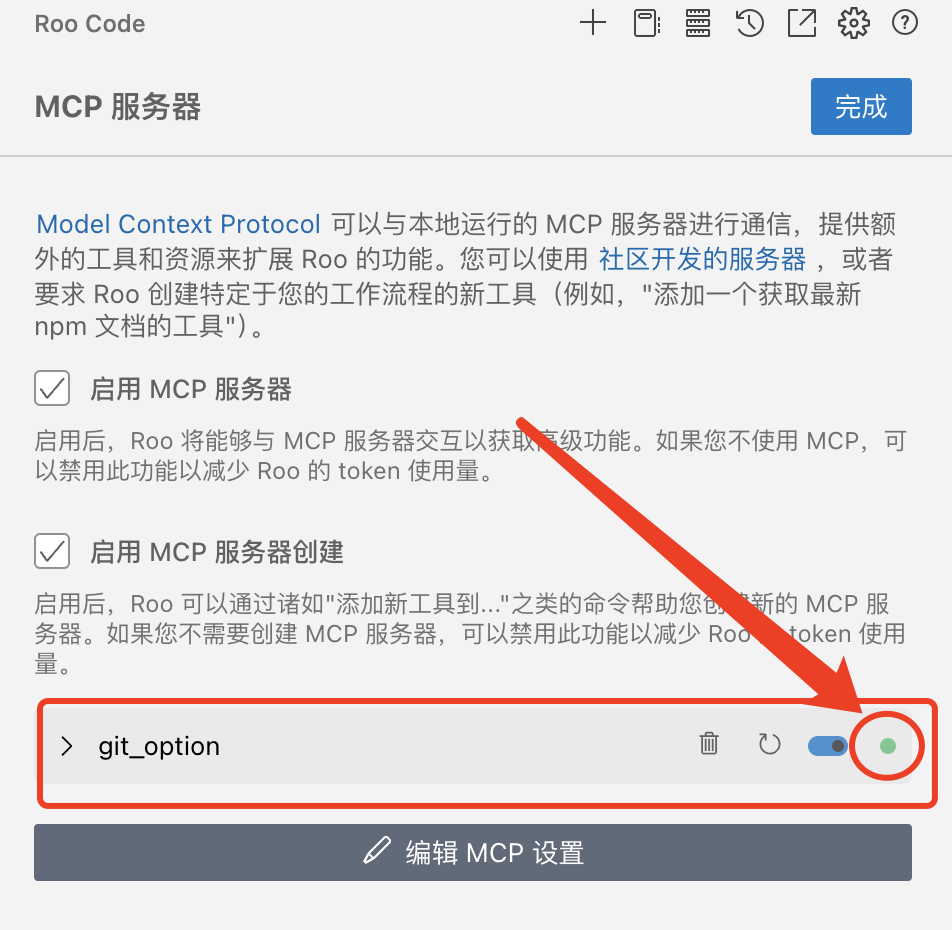

### MCP 是什么？

MCP（Model Context Protocol）可以理解成能够让大模型用工具来扩展自己能力的一个通用协议。​

​

‍

MCP Server 是实现模型上下文协议（MCP）的服务器，旨在为 AI 模型提供一个标准化接口，连接外部数据源和工具，例如文件系统、数据库或 API。

​

​

MCP 的主要传输协议。目前 MCP 支持两种主要的传输协议：

1. **Stdio 传输协议：** 主要针对本地，需要在用户本地安装命令行工具，对运行环境有特定要求
2. **SSE（Server-Sent Events）传输协议：** 主要针对云服务部署，基于 HTTP 长连接实现

我们将会分别开始构建基于 Stdio 传输协议的针对本地调用的 MCP Server，以及基于 SSE 传输协议的的部署在云服务器上的可远程调用的 MCP Server，以及对应的客户端。

‍

**MCP Server:**

1. Stdio 传输协议（本地）
2. SSE 传输协议 （远程）

**MCP Client（客户端）：**

1. 自建客户端（python)
2. Cursor
3. Cline
4. Windsurf
5. Roo Code
6. 等等

‍

### MCP Server 开发

> 注意，mcp 最低支持的 python 版本是 3.10，如果 python 低于 3.10 这个版本的话，安装 mcp 会提示找不到包。如果跟其他项目的环境冲突的话，可以考虑建设一个虚拟环境

‍

#### 配置环境

- 安装 UV （更多安装方式 -&gt; <https://docs.astral.sh/uv/getting-started/installation/>）

- MAC

  ```python
  # brew 安装
  brew install uv
  #curl 安装
  curl -LsSf https://astral.sh/uv/install.sh | sh
  ```

- Windows

  ```python
  powershell -ExecutionPolicy ByPass -c "irm https://astral.sh/uv/install.ps1 | iex"
  ```

‍

#### 创建 MCP 项目

```python
# 使用 uv 创建一个新项目
uv init build-mcp

# 切换到项目目录
cd build-mcp

# 创建虚拟环境
uv venv

# 激活
source .venv/bin/activate

#安装依赖
uv add "mcp[cli]" httpx
```

#### 简单两数相加 MCP Server

```python
# demo.py

from mcp.server.fastmcp import FastMCP

mcp = FastMCP("Demo")

# 定义 mcp tool
@mcp.tool()
def add(a: int, b: int) -> int:
    """Add two numbers"""
    return a + b

if __name__ == "__main__":
    mcp.run(transport='stdio')
```

### 在客户端中添加配置

```
"test": {
     "command": "uv",
     "args": [
          "--directory",
          "「项目绝对路径，例如」/Users/mac/mcp/test",
          "run",
          "「脚本名称」main.py"
      ]
}
```

### Roo Code 添加 MCP Server





### WindSurf 添加 MCP Server


#### 相关引用

- <https://github.com/jlowin/fastmcp>
- <https://modelcontextprotocol.io/quickstart/server>
- <https://docs.astral.sh/uv/getting-started/installation/>

‍

‍

‍

‍
